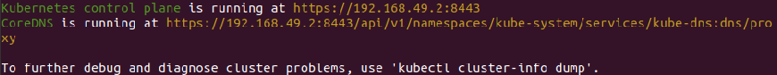
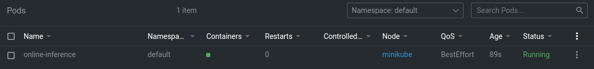
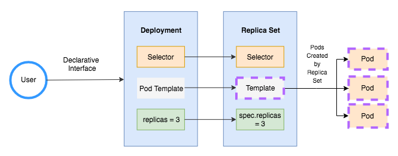

# airflow-examples
код для пары Data Pipelines

чтобы развернуть airflow, предварительно собрав контейнеры
~~~
# для корректной работы с переменными, созданными из UI
export FERNET_KEY=$(python -c "from cryptography.fernet import Fernet; FERNET_KEY = Fernet.generate_key().decode(); print(FERNET_KEY)")
docker compose up --build
~~~
Ссылка на документацию по docker compose up

https://docs.docker.com/compose/reference/up/


## Installation

[minikube start](https://minikube.sigs.k8s.io/docs/start/)
```
Resolve the issue: Exiting due to PROVIDER_DOCKER_NEWGRP
1. sudo groupadd docker
2. sudo usermod -aG docker $user
3. newgrp docker
```

## Usage kuberctl
```
Deploy: kubectl apply -f *.yaml
Delete deploy: kubectl delete -f *.yaml
```

## Solution
0. Установите kubectl
1. Разверните Kubernetes (5 баллов)  
   - `minikube start`  
   - `kubectl cluster-info`
   
2. Напишите простой Pod manifest для вашего приложения, назовите его online-inference-pod.yaml (4 балла)  
    - `minikube image load xrenya/cont_app:latest // minikube image load xrenya/cont_app:v2`
    - `kubectl apply -f online-inference-pod.yaml`
    - `kubectl get pods`

3. Пропишите Requests / Limits и напишите, зачем это нужно в описании PR. Закоммитьте файл online-inference-pod-resources.yaml (2 балла)
Requests and limits are the mechanisms Kubernetes uses to control resources such as CPU and memory. Requests are what the container is guaranteed to get. If a container requests a resource, Kubernetes will only schedule it on a node that can give it that resource. Limits, on the other hand, make sure a container never goes above a certain value. The container is only allowed to go up to the limit, and then it is restricted.
4. Модифицируйте свое приложение так, чтобы оно стартовало не сразу (с задержкой 20-30 секунд) и падало спустя минуты работы. Добавьте Liveness и Readiness пробы и посмотрите, что будет происходить. Напишите в описании -- чего вы этим добились. Закоммитьте отдельный манифест online-inference-pod-probes.yaml (и изменение кода приложения). Опубликуйте ваше приложение (из ДЗ #2) с тэгом v2 (3 балла)
The kubelet uses liveness probes to know when to restart a container.
The kubelet uses readiness probes to know when a container is ready to start accepting traffic.
The app exits and a moment later it start again.
`minikube image load xrenya/cont_app:v2`
```angular2html
def exit(signum, frame):
    sys.exit("Exit")

if __name__ == "__main__":
    time.sleep(20)
    signal.signal(signal.SIGALRM, exit)
    signal.alarm(60)
    uvicorn.run(app, host="0.0.0.0", port=os.getenv("PORT", 5000))
```
5. Создайте ReplicaSet, сделайте 3 реплики вашего приложения. Закоммитьте online-inference-replicaset.yaml (3 балла) [Replica sets](https://nirmata.com/2018/03/03/kubernetes-for-developers-part-2-replica-sets-and-deployments/)
`kubectl scale replicaset online-replicas --replicas=2 "online-replicas"`
Ответьте на вопрос, что будет, если сменить docker образ в манифесте и одновременно с этим:  
a) уменьшить число реплик: the number of docker will decrease
б) увеличить число реплик: new versions will be added an addition to old dockers

6. Опишите Deployment для вашего приложения (3 балла) Играя с параметрами деплоя (maxSurge, maxUnavaliable), добейтесь ситуации, когда при деплое новой версии:
   - есть момент времени, когда на кластере существуют как все старые поды, так и все новые (опишите эту ситуацию) (закоммитьте файл online-inference-deployment-blue-green.yaml)  
   - одновременно с поднятием новых версий, гасятся старые (закоммитьте файл online-inference-deployment-rolling-update.yaml)